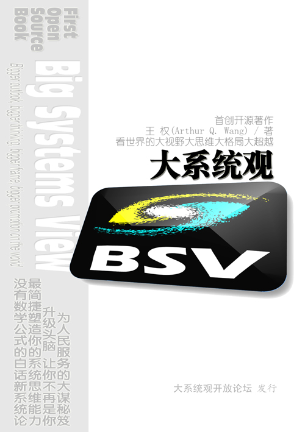
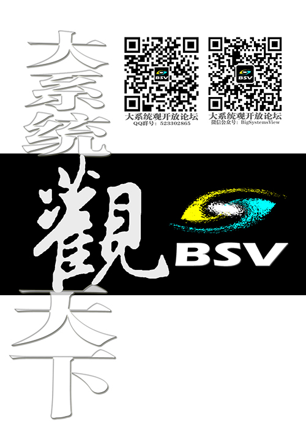
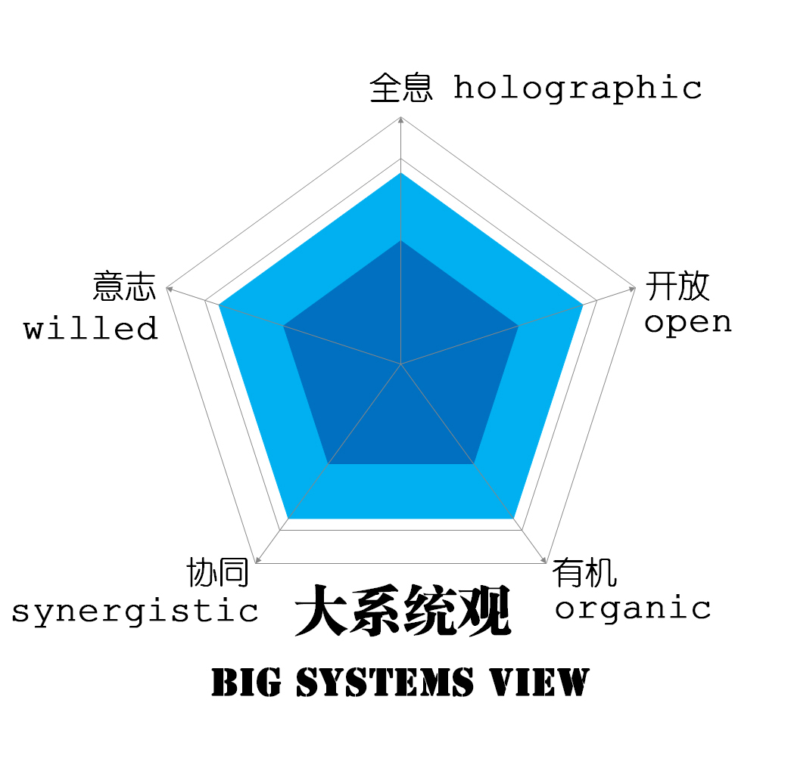

#### [中文🔃](#english)
# _Big Systems View_
## Current State

In 2016, completed the open source book: 
&nbsp;&nbsp;&nbsp;&nbsp;&nbsp;&nbsp;_**Big Systems View: Bigger outlook, bigger thinking, bigger frame, bigger promotion on the world**_

The book rejects the traditional publishing mode, and adopts the form of directly publishing the electronic version on the Internet and inviting everyone to co_compile it, setting a precedent for free and open source electronic books.

The book immediately caused a significant response in the relevant fields after its release.
Based on the version 1.0 of the original book, various materials (PPT courseware, videos, blogs, articles, etc.) with more complete ideas and richer contents have been formed through continuous iteration. 

## Summary
The concept of 'Big Systems View' is formally and explicitly proposed in this book. Previously, although this term was occasionally heard, its basic meaning was relatively broad. This book attempts to shape people's thinking patterns more scientifically with a big systems perspective, guiding readers to observe and analyze the world from a new perspective. Through the cultivation of a big systems perspective, readers can upgrade their worldview and achieve transcendence in their thoughts and actions.

The author uses the simplest words, minimizes the size, abandons mathematical formulas, and combines practical technical and management work with the current domestic and international economic and social situation to explain the basic principles of systems theory in a clear and concise manner. While summarizing the predecessors, I also discuss my own thoughts, experiences, innovative ideas, methodologies, and other aspects. It mainly includes theoretical methods, innovative practice and reflection: system theory, classic books introduction, organization and self-organization, loose coupling and tight coupling, standard and self-standard, Internetism, holographic organic system theory, system structure dynamics, information productivity, digital oilfield based-on Big Systems View, the essence of Internet+, artificial intelligence, and further philosophical thinking.

In particular, this book provides direction, methodology, and philosophical foundation for the development of Artificial Intelligence, Complex Systems, and other scientific technologies.

This book is aimed at the general public people, whether ordinary managers and technicians, leaders and experts, or even ordinary people, they will gain something, but the core target readers are those who want to do big things. 

## Next Plan
① Upgrade to version 2.0.  Integrate the author's new ideas and everyone's ideas since the release of version 1.0.

② Translate into English.

I hope to continue to receive everyone's support.

This project only provides the latest version of the manuscript and the main related documents. All other materials and the original book can be retrieved and downloaded on the Internet, or go to the official website of the [Big Systems View]: http://www.holomind.com.cn .

  

#### [English🔃](#中文)
# 《大系统观》
## 目前状态
2016年完成了开源著作： 
&nbsp;&nbsp;&nbsp;&nbsp;&nbsp;&nbsp;**《大系统观：看世界的大视野大思维大格局大超越》**

该书拒绝传统出版模式，采用在互联网上直接发布电子版并邀请大家共同编著的形式，开辟了免费开源电子著作的先例。

该书发布后立即在相关领域内引起较大反响。
在原书1.0版本基础上，通过不断迭代，形成了思想更加完备、内容更加丰富的各种资料（PPT课件、视频、公众号、文章等）。

## 主要内容
“大系统观”是本书正式明确提出的一种理念。此前，虽然偶尔可以听到见到这种提法，但其基本含义都是比较宽泛的。本书试图用大系统观更科学地塑造人们的思维模式，引导读者以全新的视野观察和分析这个世界，通过大系统观修炼升级自己的世界观，进而实现思想和行动的超越。

作者用最简单的语言，尽量少的篇幅，抛弃数学公式，结合技术和管理工作实际，联系当前国内外经济社会形势，深入浅出地阐述系统论的基本要义。在总结前人的同时，也将自己的思考体会和创新的思想成果、方法论等加以论述。主要包括理论方法、创新实践和反思等内容：系统论、经典介绍、组织与自组织、松耦合与紧耦合、标准与自标准、因特奈特主义、全息有机系统论、系统结构动力学、信息生产力、数字油田大系统观、互联网+的本质、人工智能，以及进一步的哲学思考等。

特别是，《大系统观》为人工智能、复杂系统和其他科学技术发展提供方向、方法论和哲学基础。

本书面向大众，不论普通管理人员和技术人员，还是领导和专家，甚至普通百姓，都会有所收获，但最核心的目标读者是那些想干大事的人。

## 下步计划
①升级到2.0版本。将自1.0版发布以来，作者的新思想和大家的思想融合进来。

②翻译为英文。

希望继续得到大家支持。

本项目只提供书稿最新版和主要相关文档，其他所有资料以及原书均可在互联网上检索并下载，或者，到【大系统观】官网：http://www.holomind.com.cn 下载。    

 
 
 

